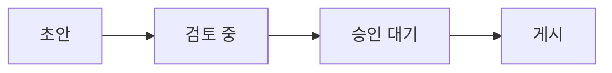

# Plex Paper Elements

아티팩트에서 쓰는 모든 표현 요소 · 요소마다 결정 기록 포함 · 2026-08-31

규칙 전문은 [DESIGN.md](DESIGN.md)에 있다.

아티팩트를 만들 때 쓰는 요소 전부를 사용 빈도 순서로 하나씩 보여준다. 원칙은 둘 — 마크다운 문법에 있는 것은 표준 HTML 매핑으로, 마크다운에 없는 것은 의미가 같은 표준 HTML 요소로. 각 요소 아래의 번호 목록은 그 요소가 지금 형태에 이른 결정의 순서다.

## Table

가장 많이 쓰는 요소. 셀 1px 테두리, 헤더 행은 인용 배경색, 마크다운 표처럼 담백하게.

| 케이스 | 플랫폼 | 결과 | 비고 |
|---|---|---|---|
| 회원 가입 — 이메일 인증 | <span class="chip tag">iOS</span> <span class="chip tag">Android</span> | <span class="chip ok">PASS</span> | — |
| 비로그인 진입 시 노출 화면 | <span class="chip tag">Web</span> | <span class="chip warn">확인 필요</span> | spec 1-4와 2-5 서술 충돌 (G-009) |
| 정기 결제 전환 영수증 | <span class="chip tag">qa</span> | <span class="chip fail">FAIL</span> | `receipt_id` null |

1. 블로그 CSS에 표 규칙이 없어 신설 — 셀 1px 테두리, 헤더는 인용 배경, 패딩 8~12px
2. 넓은 표는 table-scroll로 감싸 본문 폭을 넘지 않게

## Chip

상태 칩은 의미 색 글자 + 같은 색 테두리, 분류 칩(태그·플랫폼·환경·버전)은 무채색. 대응하는 표준 HTML 요소가 없는 유일한 본문 요소다.

상태: <span class="chip ok">PASS</span> <span class="chip warn">확인 필요</span> <span class="chip fail">FAIL</span> <span class="chip info">참고</span>

분류: <span class="chip tag">iOS</span> <span class="chip tag">Android</span> <span class="chip tag">Web</span> <span class="chip tag">qa</span> <span class="chip tag">v5.2.0</span>

1. 상태 표시용 알약 칩으로 도입
2. "글자가 이미 의미를 담는다"는 근거로 색 글자만으로 격하
3. 지라의 상태 칩 관례에 맞춰 복원 — 상태/분류 2종 체계로 확정
4. 좁은 화면에서 여러 줄로 감길 때 위아래가 붙지 않게 세로 여백 2px

## List

순서 리스트는 decimal → lower-alpha → lower-roman, 비순서는 disc → circle → square. 중첩 들여쓰기는 16px, 최대 3단.

- 가입 흐름 검증
  - 이메일 인증
    - 인증 링크 만료 경계 시각
  - 소셜 로그인
- 결제 상태 전환 검증

1. 블로그 원형: 마커 단계 구분 + 중첩 들여쓰기는 기본(40px)의 절반인 20px
2. 임베드 환경의 리셋 대비로 최상위 40px도 명시
3. 중첩 16px로 확정 — 마커+간격이 차지하는 1em과 같은 안전 하한
4. 최대 3단 — 4단이 필요해 보이면 구조의 문제, 소제목 승격이나 표로 재구성

## Checklist

완료 항목은 GFM 취소선 `~~완료~~`의 렌더링 — 매핑은 표준 요소 `del`이고 보조 텍스트 색을 물린다. 미완료는 맨 항목.

- ~~스테이징 배포 확인~~
- ~~검수 계정 8종 준비~~
- 해외 IP 접속 수단 확보

1. GFM 체크박스(`- [ ]`)의 네이티브 위젯으로 도입
2. OS 위젯이 문서 활자와 겉돌아 기각 — 취소선(del) + muted 색으로 대체

## Code

인라인은 `verify_email_token()`처럼 배경색만, 블록은 배경색 + 1px 테두리. 하이라이트는 4토큰(키워드·문자열·숫자·주석)만, 언어 라벨은 펜스의 info string에서 얻어 오른쪽 위에 표시한다.

이 문서의 하이라이트는 손으로 심은 span이 아니라, 문서 끝의 최소 스크립트(40줄 남짓, 외부 라이브러리 없음)가 실행 시점에 입힌 것이다. 원문에는 `data-lang`과 맨 코드만 있다. JS가 꺼지면 단색 코드로 강등된다.

```python
# 재시도 임계값: spec 문구는 "약 2분", 코드 기본값은 60초 (R-007)
RETRY_THRESHOLD_SECONDS = 60

def can_retry(elapsed_seconds):
    return elapsed_seconds >= RETRY_THRESHOLD_SECONDS
```

1. 단색 유지로 시작 — 하이라이터가 최대 의존성이 된다는 근거
2. 4토큰 하이라이트 시안 — 색은 전부 애플 표준(systemPurple·Red·Blue·Gray), 언어 무관 동일 팔레트
3. 작성 시점 span 방식으로 채택 — 의존성 근거가 해소됨
4. 직접 작성한 최소 JS 방식으로 전환 — 원문이 깨끗해지고, JS가 없으면 초기 규칙(단색)으로 강등
5. 언어 라벨 채택(CommonMark info string) — 라벨 자리는 상단 여백으로 확보(첫 줄 겹침 방지)

## Blockquote

배경색 + 왼쪽 4px 세로선. 허용 용법은 셋 — 원문 인용(본래 의미), 콜아웃(의미 색 변형), 문서 머리의 메타 블록(근거 spec·기준 코드처럼 다른 문서에서 온 사실의 묶음). 자기 문장을 강조하려고 넣는 것(풀 인용)은 금지 — "다른 출처"라는 요소의 의미를 어긴다. 강조는 strong·Highlight·Callout의 몫.

> spec 4.2절 — "결제 실패 시 사용자는 동일 화면에서 다른 수단으로 3회까지 재시도할 수 있다."

1. 블로그 style.css 원형을 그대로 계승
2. 파생 용법 정리 — 콜아웃과 문서 머리 메타 블록은 허용(다른 출처에서 온 내용), 자기 문장 강조용 풀 인용은 금지

## Callout

인용문 형태에 의미 색 선을 입혀 상태를 전할 때 쓴다. 새 형태를 만들지 않은 인용문의 변형이다.

> [!WARNING]
> **확인 필요: 재시도 허용 횟수**
> spec은 3회, 구현은 2회. 기획 변경인지 구현 누락인지 확인 대기 중.

1. 인용문의 변형으로 도입 — 왼쪽 선만 의미 색으로
2. 성공·경고·실패에 정보(파랑) 추가 — 4종 체계
3. 마크업을 div에서 blockquote로 재매핑 — 규칙("인용문의 변형")과 GFM alerts(`> [!WARNING]`) 구조에 일치
4. div 복귀안(GitHub의 렌더링 방식) 검토 후 기각 — `>` 문법의 표준 매핑이 blockquote이므로 원칙 (1)이 우선. 콜아웃의 내용이 자기 문장이어도 남용이 아닌 이유는 `[!TYPE]` 표지가 의미를 선언하는 방언 구조라서다
5. 색 정의 확정 — 전용 색 없이 의미 색 재사용, GFM 매핑(NOTE·TIP→정보, WARNING·IMPORTANT→경고, CAUTION→실패), 다섯째 유형(보라 자리)은 만들지 않음(4색까지가 만국 공통, 색 최소 원칙). 사용 지침: 아껴 쓴다 — 많아지면 전부 본문이 된 것

## Muted

읽어도 되고 건너뛰어도 되는 정보는 한 층 물린다. 문서 메타 줄은 렌더러가 입히고, 본문 중간에서는 <small>이렇게 small 요소로 쓴다 — HTML 표준의 부가 설명 요소다.</small>

1. muted 색 도입 — 처음엔 임의 근사값
2. systemGray #8E8E93로 교체(라이트/다크 공용) — "파스텔 제외 전부 애플 표준 색" 규칙 확정과 함께
3. 본문 중간의 부연은 small 매핑 — 표현 원칙 (2)의 정석 사례

## Footnote

출처나 긴 부연은 각주로 내린다.[^1] 표기는 GFM 확장 문법 `[^1]`과 같은 구조(위첨자 링크 + 문서 끝 목록)다.

1. GFM footnotes 확장의 렌더링 구조(sup + 링크 + 하단 목록) 채택 — 코어 표준은 아니지만 GFM·Pandoc·Obsidian이 합의한 표기

## Tile Grid

요약 숫자는 타일 그리드로 쓴다. 마크업은 dl(라벨-값 쌍의 표준 요소), 인용 배경 상자.

<dl class="stat-tiles">
<div><dt>TC 합계</dt><dd>86</dd></div>
<div><dt>P0</dt><dd>15</dd></div>
<div><dt>Gap</dt><dd>25</dd></div>
<div><dt>커버리지</dt><dd>100%</dd></div>
</dl>

1. KPI 타일은 대시보드 장식으로 금지
2. 상자 없는 인라인 요약 숫자를 대안으로 채택
3. 실물 비교 후 뒤집힘 — 타일 그리드가 가시성이 높아 정식 채택, 인라인 숫자열 기각
4. 용어를 "타일 그리드"로 확정, dl 매핑

## Card Grid

독립된 콘텐츠 단위를 나란히 보여줄 때. article 매핑. 열 정렬이 의미 있는 데이터는 카드가 아니라 표로 쓴다.

<div class="cards">
<article>
<p class="card-title"><strong>가입</strong></p>
<p>이메일, 소셜 로그인, 초대 링크</p>
<p><span class="chip ok">PASS</span></p>
</article>
<article>
<p class="card-title"><strong>결제</strong></p>
<p>카드 등록, 재시도, 영수증 발급</p>
<p><span class="chip warn">확인 필요</span></p>
</article>
<article>
<p class="card-title"><strong>알림</strong></p>
<p>수신 동의, 야간 발송 제한</p>
<p><span class="chip fail">차단</span></p>
</article>
</div>

1. 대시보드 장식으로 금지 — 소제목과 표가 대신
2. 심판대 실물 렌더링 후 채택 — article이라는 정당한 표준 매핑이 있고, 표와 역할이 갈림

## Progress Bar

단일 값의 진척. progress 표준 요소 그 자체이고, 항상 숫자를 병기한다.

<p class="progress-line"><progress value="42" max="86"></progress> <span>42/86 실행 <small>(49%)</small></span></p>

1. 진행 바는 대시보드 장식으로 금지 — 숫자로 대신
2. progress가 매핑이 아니라 표준 요소 그 자체임이 확인돼 채택, 숫자 병기 규칙과 함께
3. 네이티브 위젯 껍데기를 벗기고 시스템 토큰으로 재도색 — 벤더 의사요소는 비표준이지만 표준 요소를 유지하는 유일한 길
4. 바 + 숫자를 flex 한 줄로 — 모바일에서 숫자가 감기던 문제
5. 차트와 같이 본문 폭을 꽉 채우게 — 막대가 길수록 비율이 잘 읽힘

## Chart

차트의 정의: 진행 바를 모은 것. 한 행이 "라벨 + 막대 + 숫자", 막대 길이는 최댓값 기준 비율. 마크업은 dl이고 grid로 열만 정렬한다.

**우선순위별 TC 수** <small>단위: 개</small>

<dl class="chart">
<dt>P0</dt><dd><progress value="15" max="63"></progress></dd><dd>15</dd>
<dt>P1</dt><dd><progress value="63" max="63"></progress></dd><dd>63</dd>
<dt>P2</dt><dd><progress value="8" max="63"></progress></dd><dd>8</dd>
</dl>

행이 서로 다른 시리즈일 때는 Color Cycle을 배정 순서대로 쓴다. 아래는 순환색 7개가 전부 쓰인 형태다. 주의: 같은 지표의 범주 막대(위의 P0·P1·P2 같은)는 한 색이 기본이다 — 막대마다 색을 갈라 칠하는 것은 색이 정보를 더하지 않는 "무지개 막대" 안티패턴이고, 색 분화는 행이 각자 독립된 시리즈일 때만 한다.

**플랫폼별 검수 처리** <small>단위: 건</small>

<dl class="chart">
<dt>iOS</dt><dd><progress value="32" max="32"></progress></dd><dd>32</dd>
<dt>Android</dt><dd><progress class="s2" value="27" max="32"></progress></dd><dd>27</dd>
<dt>웹</dt><dd><progress class="s3" value="21" max="32"></progress></dd><dd>21</dd>
<dt>데스크톱</dt><dd><progress class="s4" value="17" max="32"></progress></dd><dd>17</dd>
<dt>API</dt><dd><progress class="s5" value="12" max="32"></progress></dd><dd>12</dd>
<dt>어드민</dt><dd><progress class="s6" value="9" max="32"></progress></dd><dd>9</dd>
<dt>인프라</dt><dd><progress class="s7" value="5" max="32"></progress></dd><dd>5</dd>
</dl>

1. 작성 시점에 손으로 그리는 인라인 SVG로 시작 — 단일 지표는 한 색, 값 직접 표기
2. 표 + 진행 바 대체안 검토 — 표준 요소만으로 같은 정보
3. 차트용 표는 격자선·헤더 배경 제거 — 격자는 막대 길이 비교를 방해
4. "진행 바를 모은 것"으로 정의 확정 — dl + grid, 표도 SVG도 기각. meter는 브라우저가 초록·노랑을 자동으로 칠해 의미 색과 충돌해 기각
5. 여러 시리즈는 Color Cycle의 배정 순서 + 범례, 추세선·파이는 범위 밖 — 채움색의 이력과 확정값은 Color Cycle 절 참조
6. 순환색 7개 전부의 형태 시연 추가 — 단 같은 지표의 범주 막대는 한 색이 기본이고, 색 분화는 행이 독립된 시리즈일 때만("무지개 막대" 안티패턴 경계)

## Colors

색은 최소한으로 쓴다 — 새 용도가 생기면 새 색이 아니라 아래 층들의 토큰을 재사용하고, 팔레트 확장은 마지막 수단이다. 구조는 네 층: 바탕, 회색 4역할, 애플 원색 6, 소프트 톤 7(유일한 파생층).

### Base

| 이름 | 라이트 | 다크 |
|---|---|---|
| Background | `#FFFFFF` | `#000000` |
| Text | `#000000` | `#FFFFFF` |

### Grays

역할 4개 — 면/선/글자라는 직무와 놓이는 바닥이 달라서 하나로 합칠 수 없다. 글자 회색은 읽혀야 해서 가장 진하고, 면은 배경과 간신히 구분될 만큼 연하며, 선은 바닥(흰 배경 위인가, 회색 면 위인가)에 따라 두 단계다.

| 이름 | 직무 | 라이트 | 다크 |
|---|---|---|---|
| Muted | 보조 글자 (메타·목차·분류 칩·완료 표시) | `#8E8E93` | `#8E8E93` |
| Border | 바탕 위의 선 (hr·표 셀) | `#C6C6C8` | `#38383A` |
| Fill | 면 (인용·코드·콜아웃·타일) | `#F2F2F7` | `#1C1C1E` |
| Fill Border | 면 위의 선 | `#D1D1D6` | `#3A3A3C` |

### Primaries

애플 표준 색상표의 원색 6개와 각각이 맡는 상태·역할. 새 역할이 생기면 이 여섯에서 재사용한다.

| 색 | 상태·역할 | 라이트 | 다크 |
|---|---|---|---|
| Blue | Link · Info · 코드 숫자 | `#007AFF` | `#0A84FF` |
| Purple | 방문 링크 · 코드 키워드 | `#AF52DE` | `#BF5AF2` |
| Green | Success | `#34C759` | `#30D158` |
| Orange | Warning | `#FF9500` | `#FF9F0A` |
| Red | Fail · 코드 문자열 | `#FF3B30` | `#FF453A` |
| Yellow | Highlight | `#FFCC00` | `#FFCC00` |

### Color Cycle

차트·다이어그램에서 시리즈를 구분하는 소프트 톤 7. 배정 순서는 시각 대비 사이클 — Blue에서 시작해 매번 이미 쓴 색들과 색상환에서 가장 먼 색이다. 애플 원색에서 출발해 검증기(색각 분리·명도 대역·배경 대비)로 조정한 고정값이고, 다크는 같은 색상을 어두운 명도 대역으로 밟은 변형이다.

| 순서 | 색 | 라이트 | 다크 |
|---|---|---|---|
| 1 | Blue | `#2689FF` | `#2689FF` |
| 2 | Orange | `#E68600` | `#D47B00` |
| 3 | Purple | `#C27CE6` | `#B372D4` |
| 4 | Green | `#44CB66` | `#35AC52` |
| 5 | Teal | `#4DBBCF` | `#279CB8` |
| 6 | Pink | `#FF5F7E` | `#EB5774` |
| 7 | Amber | `#D9AD00` | `#B08C00` |

<small>흰 배경 대비가 3:1에 못 미치므로 보이는 라벨(숫자 병기)이 필수 짝이다. 7을 넘으면 Blue부터 순환하되, 그 전에 묶기·표 재구성을 먼저 검토한다. 상태를 나타내는 차트는 이 순환 대신 의미 색으로 직접 매핑한다.</small>

1. 원색에 흰색 45%를 섞은 파스텔 8색으로 시작 — 8은 근거 없는 관성이었다
2. 무지개 7색 + 보색 대비 순서로 재편 (틸 기각)
3. 검증기 계산에서 두 안 모두 탈락 — 초록↔주황 적록색약 ΔE 6.1, 빨강↔보라 정상 시각 ΔE 14.4, 흰 배경 대비 전부 3:1 미만. 무지개는 색상 축 하나만 쓰는 접근이라 색각 이상에 약하다
4. 소프트 톤 7 채택 — 업계 팔레트처럼 무지개 밖 색(Teal·Pink·Amber)으로 명도·채도 축을 벌리고, 라이트·다크 각각 검증 전 항목 통과. 색 이름은 영어로 표기

## Diagram

흐름·상태 전환은 mermaid 코드 펜스로 그린다. 마크다운 원문에 텍스트로 남고, 지원하지 않는 뷰어에서는 원문이 보이는 우아한 강등.

<!-- 블로그용 SVG: diagrams/1441ec58a7a4-light.svg, diagrams/1441ec58a7a4-dark.svg. 이름은 펜스 본문(앞뒤 공백 제거)의 sha256 앞 12자리라, 본문을 고치면 SVG를 다시 만들어야 블로그가 그림을 쓴다 — 없으면 원문 코드로 강등된다. 다시 만드는 법: 본문을 d.mmd로 저장하고 npx @mermaid-js/mermaid-cli@11 -i d.mmd -c diagrams/mermaid.json -b transparent -t neutral -o diagrams/1441ec58a7a4-light.svg, 같은 명령에 -t dark -o diagrams/1441ec58a7a4-dark.svg. -->


1. mermaid 펜스 채택 — 코어 표준은 아니지만 GitHub·GitLab·Notion·Obsidian이 지원하는 사실상 표준
2. 블로그에는 mermaid 렌더러(JS 라이브러리)를 반입하지 않는다 — 필요하면 정적 SVG나 원문 코드 블록으로
3. 블로그도 mermaid로 그리는 것으로 갱신 — 단 렌더러 반입이 아니라 빌드 시점 정적 SVG 렌더. mermaid는 사이트 의존성이 아니라 빌드 도구가 되고(폰트 서브셋 생성과 같은 패턴), 사이트 런타임 JS 0 유지. 라이트/다크 대응은 구현 시 결정
4. 렌더는 배포 빌드가 아니라 로컬에서 하고 SVG를 커밋 — 배포 빌드에 Node·헤드리스 브라우저를 들이지 않고, 빌드가 네트워크에 기대지 않게
5. 라이트/다크는 두 벌 렌더 — neutral과 dark 테마 SVG를 picture가 시스템 테마로 고른다.

## Details

긴 부록·로그·원문은 `<details>`로 접는다. HTML 표준 요소라 JS 없이 동작하고, 미지원 뷰어에서는 펼쳐진 채 보인다.

<details>
<summary>Gap 리포트 25건 중 우선 항목</summary>
<p><strong>G-020</strong> <span class="chip fail">필요 (우선)</span> — 비밀번호 재설정 세 갈래가 "이메일 링크 접근 시" 항목 아래에 묶여 있다. 일반 로그인 경로의 인증 시점을 테스트 착수 전에 확정해야 한다.</p>
</details>

1. details/summary 표준 요소로 채택 — 표현 원칙 (2)에 정면 부합

## Label

키·버튼·메뉴처럼 UI에 보이는 글자를 본문에서 지칭할 때 — <kbd>Space</kbd>, <kbd>Esc</kbd>, <kbd>알림 켜기</kbd>.

1. kbd 표준 요소로 채택 — 키 입력 표기
2. 정의를 UI 라벨 전반으로 확장 — 화면의 버튼도 키캡과 같은 "누르는 것의 이름". 표기는 "레이블"이 아니라 "라벨"

## Highlight

원문에서 특정 구절을 짚을 때 — <mark>만료 24시간 전 이메일 발송</mark>처럼 mark 요소를 쓴다. 배경은 systemYellow 원색(두 테마 공용), 글자는 검정. 형광펜의 강조는 색상이 아니라 명도로 전달되어 색각 이상에도 온전히 보인다.

1. mark 표준 요소로 채택 — 배경은 파스텔 노랑, 두 테마 공용(글자는 검정)
2. 색각 이상 관점 재검토로 systemYellow 원색 #FFCC00으로 교체 — 이전 파스텔 노랑(#FFE373)은 흰 배경과 명도차 1.24:1로 모두에게 희미해 기각. 원색 재사용이라 파생값도 하나 줄었다

## Floating TOC

넓은 화면에서 본문 오른쪽에 h2·h3 목차가 상시 노출된다(이 문서에서 창을 넓혀 보면 실물이 보인다). 현재 읽고 있는 절이 강조되고, 항목을 누르면 그 절로 이동한다. 글자는 Muted, 선은 Border, 강조는 Text·Link — 전부 재사용이라 새 색이 없다.

1. 아티팩트 한정으로 채택 — 화면 폭 1200px 이상에서만 노출
2. JS가 h2·h3에서 생성(강등: 목차 없음, 본문은 온전) — 현재 절 강조는 IntersectionObserver(표준 API)
3. 본문 상단의 링크 목차는 제거 — 이중 목차가 미관을 해침. 좁은 화면·JS 없음에서는 목차 없이 스크롤

## Heading Anchor

이 문서의 h2가 실물이다. 제목에 마우스를 올리면 아이콘(진짜 링크)이 나타나고, 제목 아무 곳이나 클릭/탭해도 그 절로 이동한다.

1. 블로그 script.js의 호버/터치 앵커 이식 — 아이콘은 CDN(ionicons) 대신 인라인 SVG
2. 호버 때 넣었다 빼면 밑줄이 흔들려서, 상시 DOM + opacity 노출로 수정
3. 아이콘을 없애고 제목 클릭으로 대체 — 이동 용도라면 제목이 더 큰 목표라는 판단
4. 표준 감사 + 리더 모드 근거로 하이브리드 복원 — 표준 경로(키보드·스크린리더·우클릭 복사)는 진짜 링크가, 큰 클릭 목표는 제목(JS 향상)이 담당. 제목을 링크로 감싸지 않는 이유는 리더 모드가 제목을 링크로 렌더링해서
5. 호버 노출을 `@media (hover: hover)`로 한정 — 터치 기기(iOS WebKit)가 첫 탭을 호버로 소비해 두 번 탭해야 하던 문제
6. 아이콘을 누르면 이동과 함께 그 절의 주소를 클립보드에 복사 — 복사되면 1.5초 동안 원 안의 체크(Lucide circle-check)로 바뀌고 색은 Success, 스크린리더에는 "링크 복사됨"을 읽어 준다. 네모 체크는 폼 체크박스로 읽혀 기각. 애플의 SF Symbols는 라이선스가 애플 플랫폼용이라 웹에 못 써서 모양만 참고
7. 제목을 누르면 이동과 함께 그 제목의 아이콘을 계속 보이게 둠 — 모바일도 두 번째 탭으로 복사할 수 있게 해서 PC와 동작을 맞춘다. 호버 규칙이 아니라 누른 제목에 붙이는 표시라 5번의 두 번 탭 문제가 다시 생기지 않는다

[^1]: 커버리지 100%는 "추출한 조건은 모두 덮었다"는 뜻이지 spec 전체를 덮었다는 보증이 아니다.
